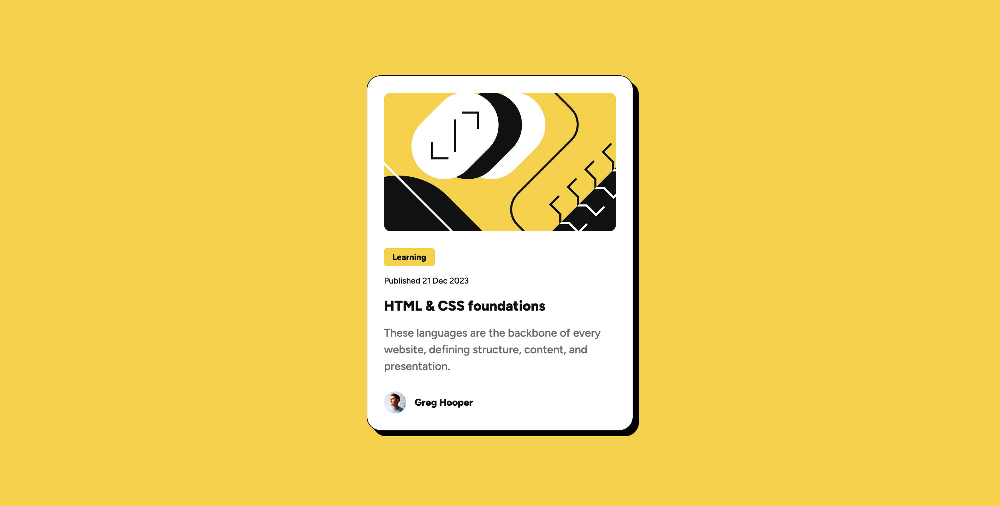

# Frontend Mentor - Blog preview card solution

This is a solution to the [Blog preview card challenge on Frontend Mentor](https://www.frontendmentor.io/challenges/blog-preview-card-ckPaj01IcS). Frontend Mentor challenges help you improve your coding skills by building realistic projects. 

## Table of contents

- [Overview](#overview)
  - [The challenge](#the-challenge)
  - [Screenshot](#screenshot)
  - [Links](#links)
- [My process](#my-process)
  - [Built with](#built-with)
  - [What I learned](#what-i-learned)
  - [Useful resources](#useful-resources)
  - [AI Collaboration](#ai-collaboration)
- [Author](#author)

## Overview

### The challenge

Users should be able to:

- See hover and focus states for all interactive elements on the page

### Screenshot

### Links

- Solution URL: [GitHub](https://github.com/ThePageGuy/blog-preview-card)
- Live Site URL: [Demo](https://your-live-site-url.com)

## My process

### Built with

- Semantic HTML5 markup
- CSS custom properties
- Flexbox
- CSS Grid

### What I learned

I learned that there is a great difference between CSSBattles and Responsive Designs, since I am used of being pixel perfect, which in results caused me to have problem when the responsiveness started to show errors.

### Useful resources

- [Validation Service](https://validator.w3.org/#validate_by_input) - Help to check that both my HTML and CSS are W3C acceptable.
- [PurifyCSS Online](https://purifycss.online/) - Help remove unused CSS Rules.

### AI Collaboration

Used ChatGPT to do an self evaluation of how my approach was, and gained some insight of how I should approach this kind of process in the future.
Which is one of looks alike, rather than pixel perfect.

## Author

- GitHub - [@ThePageGuy](https://github.com/ThePageGuy)
- Frontend Mentor - [@ThePageGuy](https://www.frontendmentor.io/profile/ThePageGuy)
